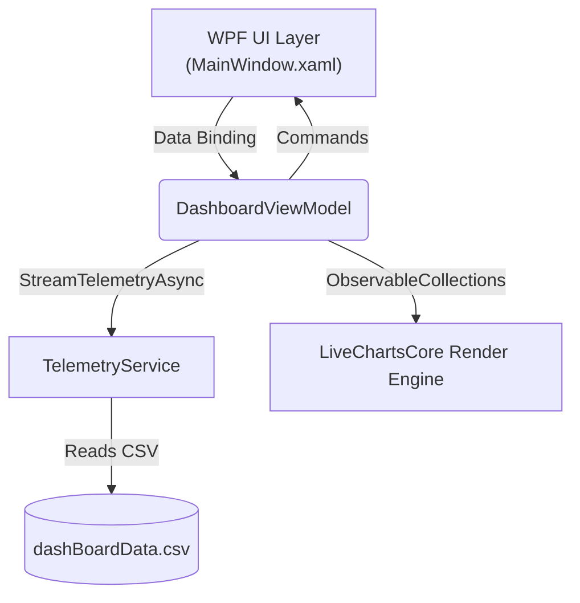

# Architecture & Design Decisions

This document outlines the architectural patterns and design decisions that govern the **Real-Time Factory Dashboard** project.

## 1. System Overview

The dashboard is a Windows Desktop application built on **.NET 10** and **WPF**. It provides a real-time visualization of machine telemetry data (Pulse, Efficiency, Red, Green, Blue) using **LiveChartsCore (v2)**.

## 2. Core Architectural Patterns

### 2.1 MVVM (Model-View-ViewModel)
The project strictly adheres to the MVVM pattern, powered by the **CommunityToolkit.Mvvm** library.
- **Views**: Pure XAML (`MainWindow.xaml`, `ConstantChangesChart.xaml`). Code-behinds are completely empty apart from `InitializeComponent()`.
- **ViewModels**: `DashboardViewModel` manages all state, charting configuration, and commands. 
- **Models**: `FactoryTelemetry` represents the shape of the domain data.

### 2.2 Dependency Injection (DI)
The application leverages Microsoft's dependency injection container (`Microsoft.Extensions.DependencyInjection`).
- All services (e.g., `ITelemetryService`) and view models are registered in `App.xaml.cs`.
- The `MainWindow` resolves the root view model from the container.

### 2.3 Async Streaming (C# 8+)
Real-time data simulated from the CSV file is streamed using C# `IAsyncEnumerable<T>`. This ensures non-blocking, memory-efficient data consumption, allowing the UI thread to remain perfectly responsive during high-frequency data updates.

## 3. High-Impact Design Decisions

### 3.1 LiveCharts2 Migration
The project was migrated from legacy LiveCharts v0 to the modernized **LiveChartsCore v2.0.0-rc5.1**.
- **Why?** LiveCharts2 uses the high-performance SkiaSharp rendering engine, providing significantly better frame rates and hardware acceleration for real-time WPF applications.
- **X-Axis Optimization**: The original application bound the X-axis to raw `DateTime.Ticks` (in the billions). When migrating to SkiaSharp, this caused floating-point precision loss. We solved this by normalizing the data to track total seconds since a universal `TimeZero` epoch.

### 3.2 Custom Canvas Gauge
While LiveCharts2 provides standard `PieChart` components that can mimic gauges, we built our angular gauge using pure WPF `Path`, `Line`, and `RotateTransform` primitives on a `Canvas`.
- **Why?** Pixel-perfect alignment of the colored arcs, custom needle pivot, and absolute positioning of tick labels (60, 70, 80, 90) were impossible to achieve with the constrained layout of a PieChart. Using WPF primitives guarantees total visual fidelity and control.

### 3.3 Fire-and-Forget Cancellation
The "Start/Stop" button uses a standard synchronous `[RelayCommand]` that executes the long-running stream inside an unawaited Task. 
- **Why?** Standard `[RelayCommand(IncludeCancelCommand = true)]` or async commands block execution state until the `Task` finishes. By using fire-and-forget coupled with a transient `CancellationTokenSource`, the button responds instantly to state changes, allowing seamless start/stop toggling without UI deadlocks.

## 4. Error Handling
Global unhandled exception handlers are deeply integrated into `App.xaml.cs` (capturing Dispatcher, Domain, and Unobserved Task exceptions). They guarantee a silent log flush to a local `crash.log` file, ensuring diagnostic stability even in production deployment scenarios.
