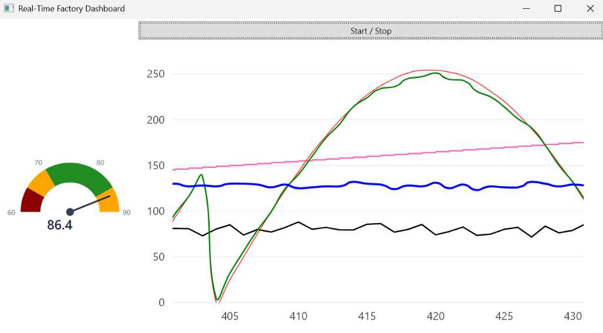

# Real-Time Factory Dashboard


A professional, high-performance WPF desktop application designed to visualize factory machine telemetry data in real-time. Built entirely on **.NET 10**, featuring hardware-accelerated charting via **LiveCharts2 (SkiaSharp)** and a robust MVVM architecture using the **CommunityToolkit.Mvvm**.



## 🚀 Key Features

- **Real-Time Data Streaming:** Simulates a live data ingest from factory sensors with asynchronous `IAsyncEnumerable<T>` streaming.
- **Hardware-Accelerated Charts:** Utilizes SkiaSharp (via LiveCharts2) for flawless, 60FPS 30-second sliding window animations without locking the UI thread.
- **Precision Custom UI:** Features a pixel-perfect, mathematically computed WPF angular gauge drawn with primitive `<Path>` arcs and `<RotateTransform>` animations for ultimate visual fidelity.
- **Modern Architecture:** Built on modern C# 14, strictly separating UI from logic with the MVVM pattern and Microsoft Dependency Injection container.
- **Production-Ready:** Includes a robust `CancellationToken` based fire-and-forget toggle for instant UI feedback, and global crash handlers with UTC-timestamped local logging.

## 🛠️ Tech Stack

- **Framework:** .NET 10.0 Windows Desktop
- **UI:** WPF (Windows Presentation Foundation)
- **Architecture:** MVVM (CommunityToolkit.Mvvm), DI (Microsoft.Extensions.DependencyInjection)
- **Charting:** LiveChartsCore.SkiaSharpView.WPF v2.0.0-rc5.1

## 🏁 Getting Started

### Prerequisites
- [.NET 10.0 SDK](https://dotnet.microsoft.com/download/dotnet/10.0)
- Visual Studio 2022 (v17.13+) or VS Code with C# Dev Kit

### Build & Run
```bash
# Clone the repository
git clone https://github.com/millenniumsingha/real-time-info-dashboard.git
cd real-time-info-dashboard

# Build the project
dotnet build src/Dashboard/Dashboard.csproj -c Release

# Run the application
dotnet run --project src/Dashboard/Dashboard.csproj -c Release
```

## 📚 Documentation

See our comprehensive documentation for deep dives into the codebase:
- [Architecture & Design Decisions](ARCHITECTURE.md) - Explains MVVM setup, LiveCharts2 migration, and custom gauge drawing.
- [Contributing Guidelines](CONTRIBUTING.md) - How to get involved, our branch strategy, and PR expectations.
- [Changelog](CHANGELOG.md) - Complete history of versions and upgrades.

## 📄 License

This project is licensed under the MIT License - see the [LICENSE](LICENSE) file for details.
